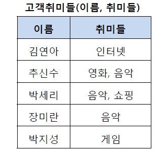
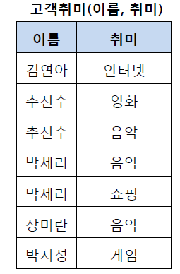
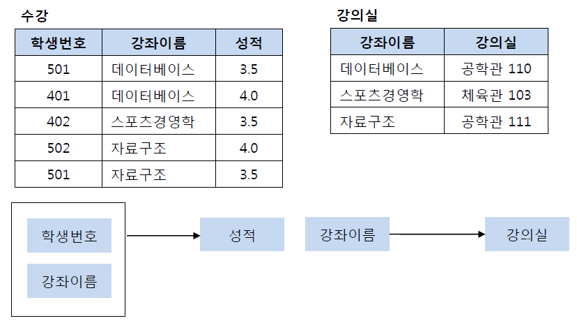
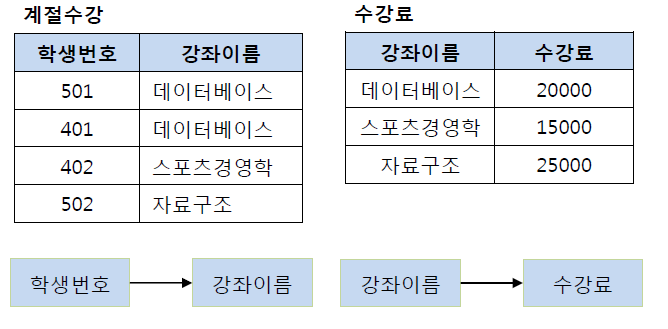
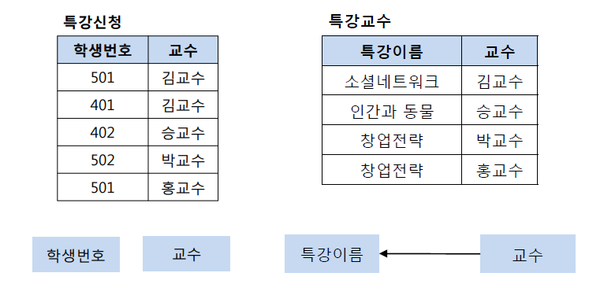
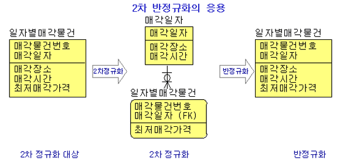
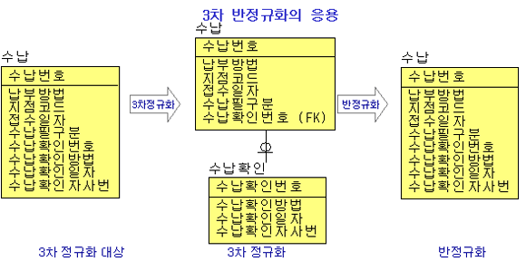

# 정규화

## 0. 정규화란?

> - 릴레이션간 잘못된 종속 관계로 인한 이상현상을 해결하는 것
> - 저장공간을 효율적으로 사용하기 위해 분리하는 것

### 장점

- 데이터베이스 변경 시 **이상 현상(Anomaly)** 을 줄일 수 있음
  - 새로운 데이터 추가 혹은 삭제시에 안정성 유지

#### 이상현상 ?

- 삽입 이상(Insertion Anomaly) : 튜플 삽입 시 특정 속성에 해당하는 값이 없어 NULL을 입력해야 하는 현상
- 삭제 이상(Deletion Anomaly) : 튜플 삭제 시 같이 저장된 다른 정보까지 연쇄적으로 삭제되는 현상
- 갱신 이상(Update Anomaly) : 튜플 갱신 시 중복된 데이터의 일부만 갱신되어 일어나는 데이터 불일치 현상

### 단점

- 릴레이션의 분해로 인해 릴레이션 간의 JOIN연산 증가
  - 이를 개선하기 위해, 정규화의 반대인 **"반정규화"** 를 하기도 함

## 1. 정규화 정도 NF

> 정규화된 정도는 NF로 표현 (Normal Form)

1. 제1정규형
2. 제2정규형
3. 제3정규형
4. 보이스/코드 정규형
5. 제4정규형
6. 제5정규형

- _1-4번까지 기본 정규형, 5-6 고급정규형_

## 2. 정규화 하기

### (1) 제 1 정규화

> - 테이블의 컬럼이 **원자값**(Atomic Value, 하나의 값)을 갖도록 테이블을 분해

### (2) 제 2 정규화

> - **완전 함수 종속을 만족**하도록 테이블을 분해
> - 기본키의 부분집합이 결정자가 되지 않도록 함

> - IN 예시, 기본키는 (학생번호, 강좌이름)
> - but, <u> 부분집합인 강좌이름이 결정자가 됨 </u> => 제2정규형 만족X

### (3) 제 3 정규화

> - **이행적 종속**을 없애도록 테이블을 분해
> - 이행적 종속이라는 것은 A -> B, B -> C가 성립할 때 A -> C가 성립

> - IN 예시, 기본키는 (학생번호는 강좌이름 결정, 강좌이름은 수강료 결정) => 이행적 => 제3정규형 만족X

> - **왜 필요할까 ?**
>   > - 501번 수강생이 수강하는 강좌가 자료구조로 바뀌면?
>   > - 25000원 짜리 자료구조 강의를 20000원 내고 수강하게됨

### (4) 보이스/코드 정규화

> - 제3 정규화를 진행한 테이블에 대해 **모든 결정자가 후보키**가 되도록 테이블을 분해하는 것

> - IN 예시, 결정자는 (학생번호, 특강이름), 교수
> - 교수는 후보키가 아님

## 3. 반정규화

### 반정규화 하는 이유

1. 정규화를 지켜 종속성, 활용성을 높였으나 성능이 느린 경우
2. 특정 범위 데이터만 자주 처리하는 경우
3. 요약/집계를 자주 하는 경우

### 반정규화 예시

1. 1차 반정규화
   - 

   - **정규화?** 원자값을 갖도록 1차 정규화
   - <u>**반정규화?**</u> 최대 2회 까지 방문 가능하다는 규칙을 이용하고, 성능, 단순성을 고려해 반정규화

2. 2차 반정규화
   - 

   - **정규화?** 매각일자는 **기본키의 부분집합** 인데 매각장소와 매각시간을 결정하므로 2차 정규화
   - <u>**반정규화?**</u> 일자별 매각물건 조회를 위해 JOIN이 일어나므로 이를 개선하기 위해 반정규화

3. 3차 반정규화
   - 
   - **정규화?** **이행적 종속** (수납번호 -> 수납 확인 번호 -> 수납확인방법, 수납확인일자, 수납확인자사번) 이 존재하여 3차 정규화
   - <u>**반정규화?**</u> 마찬가지로 수납번호로 한번에 조회하기 위해서 반정규화

---

##### 참고 블로그

[참고 블로그1](https://code-lab1.tistory.com/48)
[참고 블로그2](https://superohinsung.tistory.com/111)
[참고 블로그3](http://keiis.co.kr/study0/600.Utility/A100.DB/E010.ERwin/100.normalization.html)
