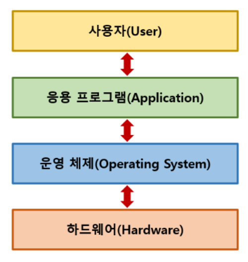
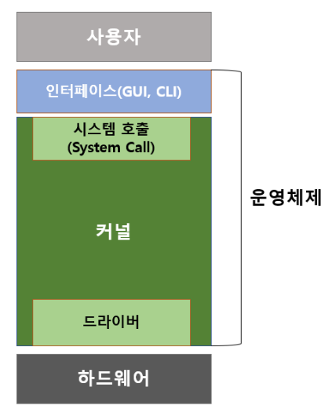
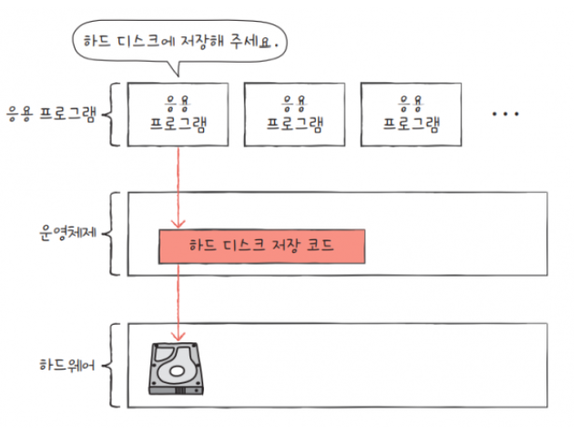
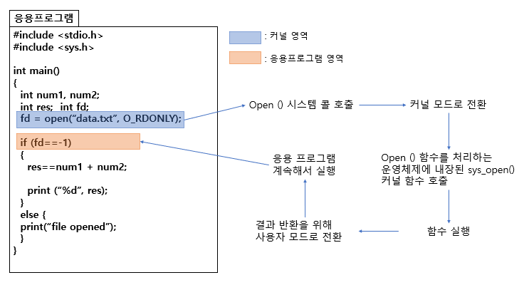

# :computer: 운영체제 

## 0. 운영체제의 개념 
> 컴퓨터 시스템의 자원들을 효율적으로 관리하며, 사용자가 컴퓨터를 편리하고, 효과적으로 사용할 수 있도록 환경을 제공하는 여러 **프로그램의 모임**
> 
> 사용자를 위한 프로그램이 아닌 <u>**사용자가 실행하는 프로그램을 위한 프로그램**</u>
> 
> EX ) 윈도우, 맥OS, 리눅스 등.. 

###  컴퓨터 구조도 
> 하드웨어 바로 위에 OS 위치 

## 1. 운영체제 역할

> #### if 운영체제가 없다면
> 
> #### 운영체제를 통해서 
> 

1. 자원 관리
2. 메모리 관리 
3. 프로세스 관리
4. 디스크 / 파일 시스템 관리 
5. 입출력 관리 
6. 사용자 인터페이스 (UI)
   - GUI, CUI .. 
7. 네트워킹
8. 오류처리
9. 시스템 보안

## 2. 운영체제 구성

### 인터페이스 PART 

- 사용자는 인터페이스를 통해서 커널에 명령을 내림 !
- 정확하게는 **사용자 애플리케이션(응용 프로그램)**이 커널에 접근하는 것임 

### 커널 PART
- 운영체제의 핵심 
- 프로세스, 메모리, 저장장치를 관리하는 핵심적인 기능

#### 시스템 호출 (system call)
- 시스템 자원 사용 함수 
- 인터럽트 (interrupt, trap) 중 하나 
- 소프트웨어는 하드웨어에 바로 접근할 수 없음
  - 하드웨어에 접근해서 일을 처리할때 실수를 막기 위함 
  - 운영체제가 컴퓨터 자원을 보호 

#### 드라이버 
- 커널과 하드웨어 사이 인터페이스 
- 설치 프로그램이 필요한 하드웨어 
  - 이때 이 설치 프로그램(소프트웨어)를 드라이버라고 한다. 
  
  
  
## 3. 유저모드와 커널 모드 
### 유저 모드 (user mode) 
-  유저(사용자)가 접근할 수 있는 영역을 제한적으로 두고, 프로그램의 자원에 함부로 침범하지 못하는 모드

### 커널 모드 (kernel mode)
- 모든 자원(드라이버, 메모리, CPU 등)에 접근, 명령 가능 모드 

### 프로세스의 모드 전환 
>  프로세스는 유저모드 <-> 커널 모드를 전환 
> 
> **why ?** :cd: 커널영역을 보호하기 위해서 ! 
#### 유저 모드 -> 커널 모드 
  - system call 
#### 커널 모드 -> 유저 모드 
  - system call return (system call이 일을 수행하고, 리턴값을 전해줌)

##### 참고 
[참고 블로그 1](https://hongong.hanbit.co.kr/%EC%9A%B4%EC%98%81%EC%B2%B4%EC%A0%9C%EB%9E%80-%EC%BB%A4%EB%84%90%EC%9D%98-%EA%B0%9C%EB%85%90-%EC%9D%91%EC%9A%A9-%ED%94%84%EB%A1%9C%EA%B7%B8%EB%9E%A8-%EC%8B%A4%ED%96%89%EC%9D%84-%EC%9C%84%ED%95%9C/)
[참고 블로그 2](https://velog.io/@0mi/%EC%9A%B4%EC%98%81%EC%B2%B4%EC%A0%9C-%EC%BB%A4%EB%84%90-%EB%AA%A8%EB%93%9C-%EC%82%AC%EC%9A%A9%EC%9E%90-%EB%AA%A8%EB%93%9C)